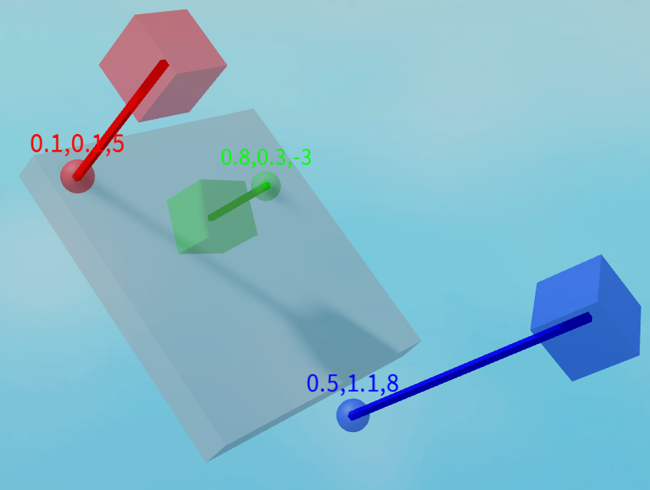
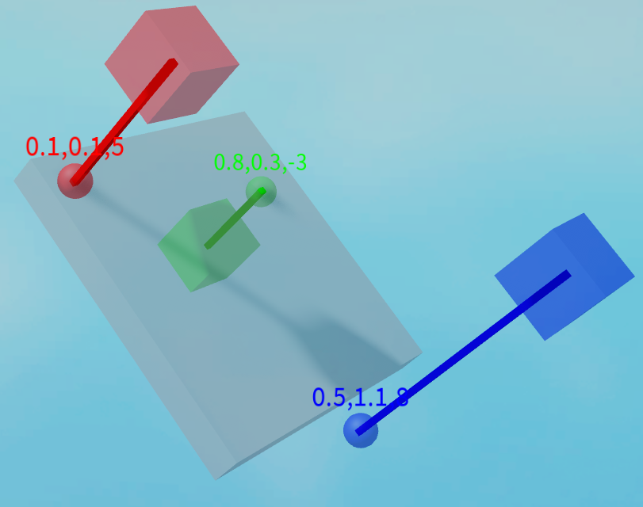

# PartUtility
`PartUtility` provides helper functions for math related to
parts for custom interactions.

## `static float,float,float PartUtility.Raycast(BasePart Part, CFrame AimingCFrame,Enum.NormalId Face)`
Ray casts to a surface. Returns the relative
X and Y position of the face, and the Z for
the direction (>0 is facing, <0 is not facing).

## `static float,float,float PartUtility.Project(BasePart Part, Vector3 HandPosition,Enum.NormalId Face)`
Returns the relative position that is projected
onto the plane. Returns the relative X and Y position
of the face, and the Z for the direction (>0 is
before the plane, <0 is after the plane).

