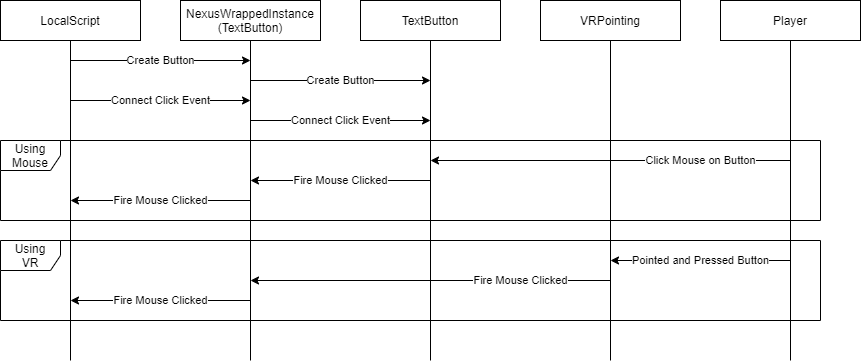

# Design
!!! Warning
    `NexusWrappedInstance` will be removed in a future version. The
    design covered is deprecated as well.

The core design of Nexus VR Core is based
on the features of [Nexus Wrapped Instance](https://github.com/TheNexusAvenger/Nexus-Wrapped-Instance),
such as being able to manually invoke
events and add custom properties and functions.


To the developer, the only difference is using
`NexusWrappedInstance.new`/`NexusWrappedInstance.GetInstance`
instead of `NexusInstance.new`. Listening the events
is identical otherwise. There are some exceptions
where extra properties are added, like in the `ScreenGui`
for VR and non-VR usage.

```lua
local NexusWrappedInstance = ...
local TestButton = NexusWrappedInstance.new("TextButton")
TestButton.Size = ...
TestButton.Parent = ...

TestButton.MouseButton1Down:Connect(function()
    ...
end)
```